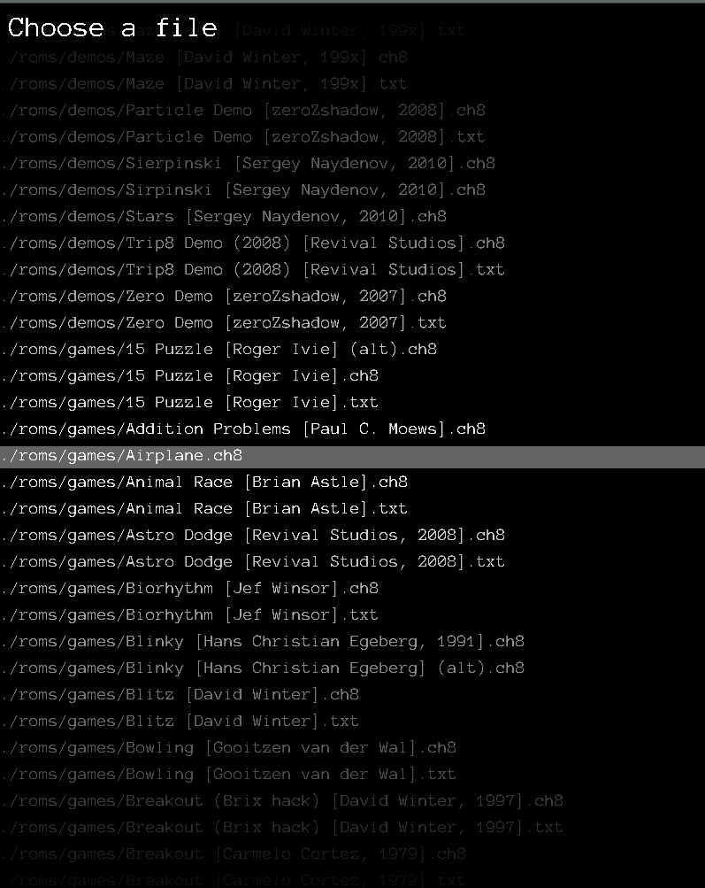
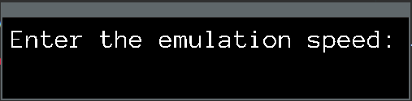
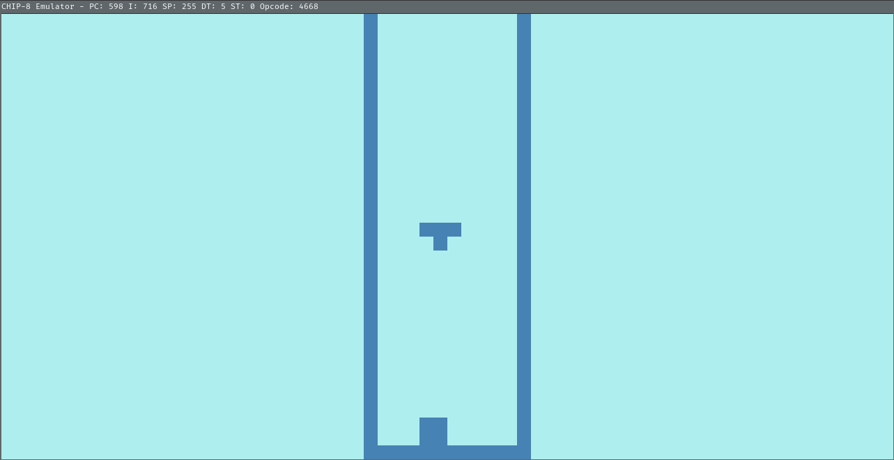
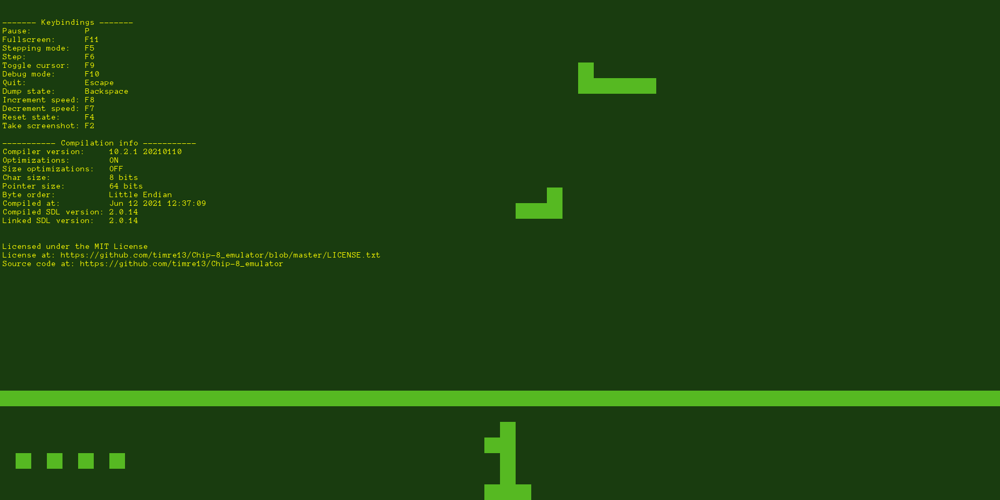
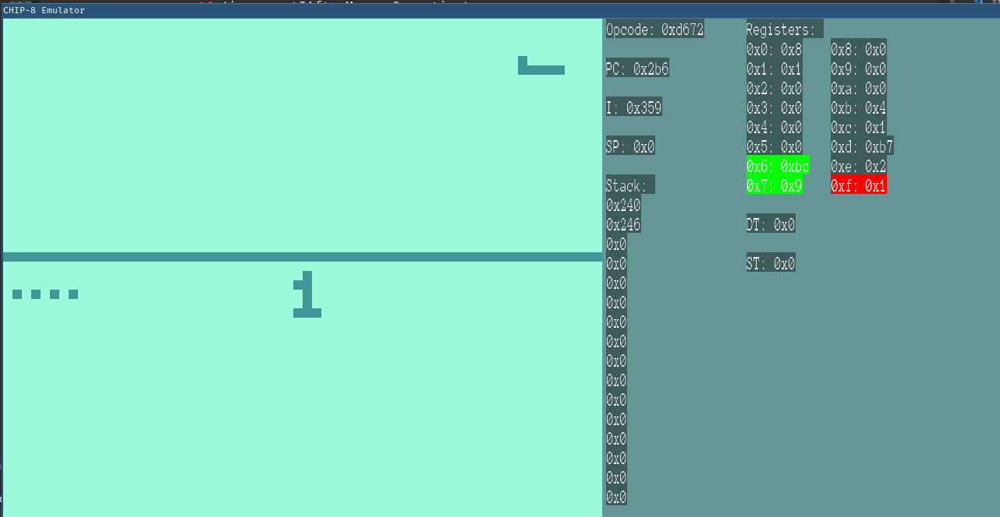

# CHIP-8_emulator
CHIP-8 emulator with debug view. Written in C++ using SDL2.

## Compiling and running

Dependencies:
* SDL2
* SDL2_ttf
* ncurses

After cloning the repository, execute `git submodule init` to fetch the [assembler's source code](https://github.com/timre13/chip8asm).

### Linux
On a Debian-based system they can be installed by running the command:
~~~
sudo apt install libsdl2-dev libsdl2-ttf-dev libncurses-dev
~~~
Compiling:
~~~sh
mdir build # Create a directory for the build files
cd build # Step into the directory
cmake .. # Generate build files
make # Build
cp ../*.ttf . # Copy the font to the build directory
cp -r ../roms . # Copy the ROMs to the build directory
~~~

## Usage

### Select a CHIP-8 ROM
When you start the emulator, the ROM selector opens. It shows the ROMs in the ./roms directory and in its subdirectories. You can copy your own ROMs here.

When you selected the ROM using the arrow keys, press Enter. An another dialog will open.

You can cancel the selection by pressing the Escape key.

### Select the emulation speed
After you selected the file, the emulation speed asker dialog opens.

Here you can enter the emulation speed. The default value is 500 instructions per second. This is multiplied by the entered value, so if you enter 1.5 it is 500 * 1.5 = 750 instructions.

If you press enter without entering a number, the default value is used.

You can cancel the operation by pressing the Escape key.

### Using the emulator
After you select the ROM and enter the speed, the emulator window opens. There you can see the output of the ROM.

### The title
The title contains the string `CHIP-8` and the speed of the emulation.

If the program is waiting for input, it is indicated as *waiting for keypress*

If the user paused the program, there is *[PAUSED]* at the end of the title.

### The window content
The window displays the output of the executed ROM. The programs can draw on a 64 px width and 32 px height buffer. The coordinates are scaled up so the output fills the window with fixed ratio.

The content can flicker, this is due to how the CHIP-8 interpreter is designed.

### Keys

#### Keypad
The CHIP-8 can accept 16 (0xf) keys by design.

The original keypad:

    1 2 3 c
    4 5 6 d
    7 8 9 e
    a 0 b f

This is how the keys are mapped to the (US) keyboard:

    1 2 3 4
    q w e r
    a s d f
    z x c v

#### Function keys

The function keys can be modified in the `config.h` file before compiling.

##### P
Pauses the program. Press again to resume. Disables stepping mode if it is active.

##### F1
Toggles the help screen. The help screen shows the keybindings and some compilation info.

##### F2
Creates a screenshot of the game and saves it as a BMP image. The filename is the time in the C strftime() format `%y%m%d%H%M%S.bmp`.

##### F4
Resets the emulator. All the registers, the stack, the memory and the frame buffer are reset to the default values, then the ROM is loaded in again.

##### F5
Enables stepping mode. Disables paused mode if active.

##### F6
Executes an instruction in stepping mode. No effect if stepping mode is not active.

##### F7
Slows down the emulation speed by 5%.

##### F8
Speeds up the emulation speed by 5%.

##### F9
Hides/Shows the mouse cursor.

##### F10
Enables debug mode.

In debug mode you can see the currently executed opcode, the program counter,
the index register, the stack pointer, the content of the stack, the register values,
the delay and the sound timers. If the program reads from a register, its background is green
colored, if the program writes to it, it is red colored, if both, its yellow.
It is also displayed when a program
reads which key is pressed.

All the values are displayed as hexadecimal with the 0x prefix.

##### F11
Toggles the fullscreen mode.

##### Escape
Exits the emulator.

##### Backspace
Dumps the memory, the registers, the framebuffer and the stack to the terminal.

## License
Licensed under the MIT license.
